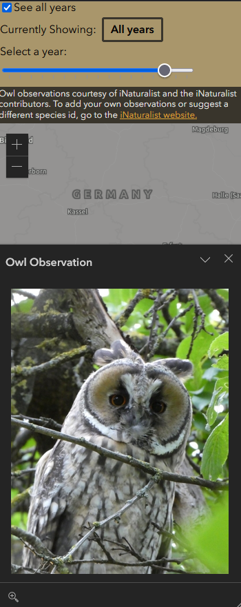

# Owls of Bavaria

This is a web mapping application to display owl sightings in Bavaria using data from iNaturalist.

This project is still in progress, but you can [view the current version of the project here](https://owls-of-bavaria.pages.dev/).

## About

This web mapping application is being built in honor of my mother who enjoys birding and is really into owls. The application takes owl observation data from iNaturalist and displays it on a map. The observations generally come with images and the names of the owl species and zooming in on the location allows birders to see, where owl observations are being made in their area. Users can currently filter the observation by owl species. It is also intended to motivate users to go out and make their own animal observations which they can then add to iNaturalist where they can be used by scientists. 

Future additions will come with more information about the owls and options to filter by dates.

## Tools Used

* React using Vite
* Redux
* ESRI's ArcGIS Maps SDK for JavaScript
* iNaturalist API

## Install your own version

1. Clone the GitHub repository.

2. Install required packages.

```
npm install
```

3. Obtain an [Esri API Key](https://developers.arcgis.com/documentation/mapping-apis-and-services/security/tutorials/create-and-manage-an-api-key/). 

    -  Note 1: if you aren't able to get an Esri API key, you will still be able to run the application, however, you will have to find a free basemap and add the link to it as the [basemap](https://github.com/lujoh/owls_of_bavaria/blob/df6d2385a9bcec9339fd5af6fec2841307e151a3/src/features/map/loadMap.jsx#L10)
    - Note 2: if you are deploying your application to the public be sure to restrict your referrers with Esri so that unauthorized users can't use your key

4. Create a .env file based on the sample with the items

```
VITE_DEBUG=<true,false> //adjust if extra information gets logged to the console
VITE_ARCGIS_API_KEY=<API Key> //your Esri API Key
VITE_WEBSITE_TITLE=Owls of Bavaria //the website title - feel free to adjust
```

5. Run the code locally.
```
npm run dev
```

6. Build the code to deploy in production.
```
npm build
```

## Customize the Application

Do you like the idea of a webmap about plant or animal observations, but you're not in Bavaria and you don't really care about owls? Now you can customize the application with your favorite location and animal.

NOTE: iNaturalist is a free API and the query for obtaining species can only return 200 records at a time. If you make your location too large or your species too broad it will take too long to load and you may overload the API. You can test out your query with the selected species and location in the iNaturalist app in advance and see how many results get returned. Try to keep it under 1000 results.

Follow steps 1-4 of the installation instructions.

Customize the [configureApp file](configureApp.jsx).

To see an example of a customization check out the [customized_sample branch](https://github.com/lujoh/owls_of_bavaria/tree/customized_sample). It has a custom name in the .env file and custom species and location in the configureApp file.

### Customize the animal/plant

Save the name of the species as you want it to appear in the app in SPECIES_NAME.

Find the id of the species you want to see in iNaturalist and save it in the TAXON_ID. To find the id, visit the [iNaturalist API taxon documentation](https://api.inaturalist.org/v1/docs/#!/Taxa/get_taxa) and search for your species in the GET/taxa section. You will want the value that is stored in "id". If your species has a name that might return many results, it might be easier to search for the scientific name.

### Customize the location

Find the id of the location you are targeting in the [iNaturalist API places documentation](https://api.inaturalist.org/v1/docs/#!/Places/get_places_autocomplete).

Save the "id" value inside PLACE_ID.

Copy the "location" value inside an array in "CENTER". You will need to copy the location coordinates in the order that they appear in the iNaturalist response without any quotation marks. 

In EXTENT you will want to save coordinates for a bounding box that will limit how far the users can pan the map from the initial location. You may need to play around with these values, but a good starting point will be to look at the "bounding_box_geojson" values in the iNaturalist response and make the xmin/xmax values just a little smaller/larger than the smallest/largest first values of the individual coordinates and handle the ymin/ymax values the same way for the second values.

You may also want to adjust the DEFAULT_ZOOM depending on the size of your desired location. This will be a positive integer.

An optional thing you can do in order to get the area you are observing highlighted in darker grey is to replace the [NotBayern GeoJSON file](/src/assets/NotBayern.geojson) with a file for your location. 

To do this, you can follow the steps in [this John Nelson tutorial](https://www.esri.com/arcgis-blog/products/arcgis-pro/mapping/steal-this-faded-overlay-style-please/) up until the point where you get the polygon set up. Then you can export that polygon as a GeoJSON file and use it to replace the NotBayern.geojson file. (Keep the name of the file.)


## Showcase

In a neutral state, the page shows the map with all of the observations on the right and a list of the owl species observed with observation counts on the left.


After selecting an individual owl observation from the map, a popup appears with an image of the observation and related information.


You can filter the observations by species by selecting the filter button on the species card that you want to see. This will highlight observations of the relevant species and grey out all other observations.


Inside the Filters tab, you can also filter the observations by the year that they were observed and hide those observations that have an obscured location.


On the mobile version of the website, the map moves to the bottom of the page and the owl species cards move to a horizontally scrollable section at the top.


When opening features on the mobile version of the website, the popup shows up below the map and can be expanded by clicking the arrow on the right.



For an example of a version of the website that has been customized with a different species and location, here you can see Jumping Spiders in Santa Cruz County, California.

